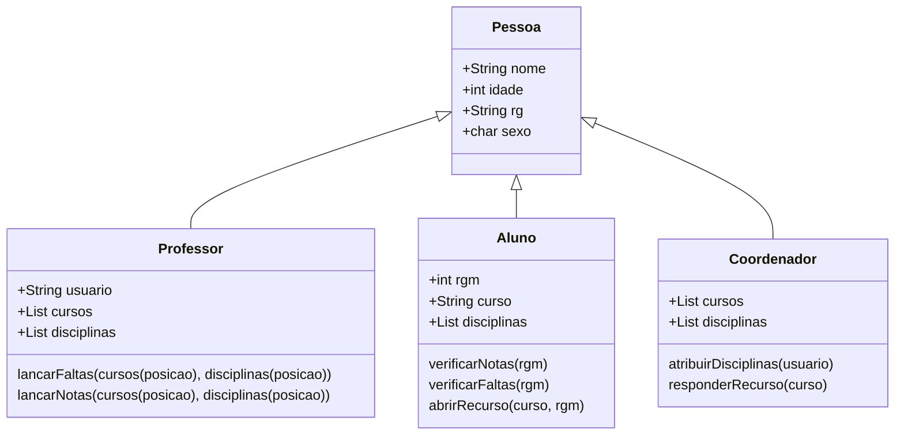

```mermaid

classDiagram 

    Pessoa <|-- Professor
    Pessoa <|-- Aluno
    Pessoa <|-- Coordenador

    class Pessoa {
        +String nome
        +int idade
        +String rg
        +char sexo
    }

    class Professor{
      +String usuario
      +List<curso> cursos
      +List<disciplina> disciplinas

      lancarFaltas(cursos(posicao), disciplinas(posicao))
      lancarNotas(cursos(posicao), disciplinas(posicao))
    }
    class Aluno{
      +int rgm
      +String curso
      +List<disciplina> disciplinas

      verificarNotas(rgm)
      verificarFaltas(rgm)
      abrirRecurso(curso, rgm)
    }

    class Coordenador{
        +List<curso> cursos
        +List<disciplina> disciplinas

        atribuirDisciplinas(usuario)
        responderRecurso(curso)
    }
   
```